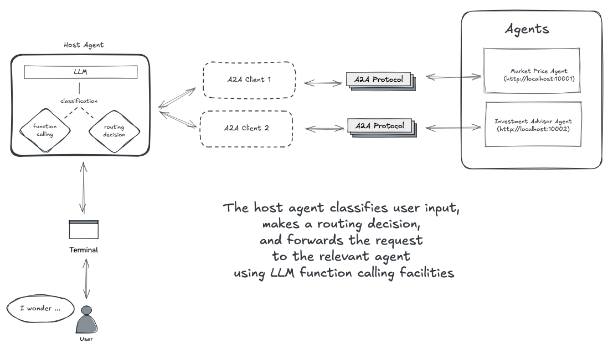

# Agent2Agent (A2A) Demo with LLM Function Calling

This repository demonstrates how to connect multiple AI agents using the `Agent2Agent` (A2A) protocol an open standard developed by `Google` and donated to the `Linux Foundation`. A2A enables framework and language agnostic communication and collaboration between agents.

In this demo, a `Host Agent` classifies user input, makes a routing decision, and forwards the request to the appropriate agent via A2A clients using `LLM function calling`.

## Architecture / Flow

1. **User Input** is received from the terminal.
2. The **Host Agent (LLM-powered)**:
   * Classifies the request.
   * Decides the routing.
   * Uses **function calling** to forward the request to the relevant agent.

3. The **A2A Clients** handle communication between the Host Agent and other agents(_e.g., localhost:10001, localhost:10002_) using the **A2A protocol**.

4. **Agents** process the request:
   * **Market Price Agent** → provides the price information of the requested currency, metal, or stock
   * **Investment Advisor Agent** → provides investment-related advice in the requested area



## 🚀 Getting Started

### Prerequisites
* JDK 17+
* Maven 3.8+
* Ollama

### Installation

Clone the repository:

```bash
git clone https://github.com/hakdogan/agent-to-agent-demo

cd a2a-client

mvn clean install

java -jar target/quarkus-app/quarkus-run.jar
```

### Running the Other Agents

* **Market Price Agent**: see [financial agent](https://github.com/hakdogan/financial-agent) repo
* **Investment Advisor Agent**: included in this repository (see /agent-to-agent-demo/investment-advisor)

### 🧩 Example Flow

```text
Ask to learn the price of any currency, stock, or precious metal you want or to get investment advice.                                                                      
Type 'exit' to exit!

How many Turkish Liras is 1 dollar?

Task status: submitted
Task status: working
Task status: working
Task status: completed
The current exchange rate for 1 USD is approximately 41.5605 TRY. 

Please note that the data is delayed and last refreshed at 2025-09-27 19:43:56 UTC. The actual exchange rate may have changed since then.

ask new question

What are the risks of crypto investing?

Task status: submitted
Task status: working
Task status: working
Task status: completed

As an investment advisor, I must emphasize that investing in cryptocurrencies carries significant risks. Here are some of the key concerns:

...
```

